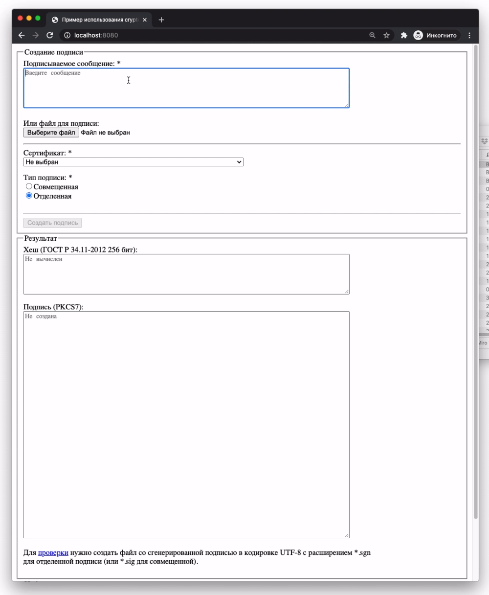
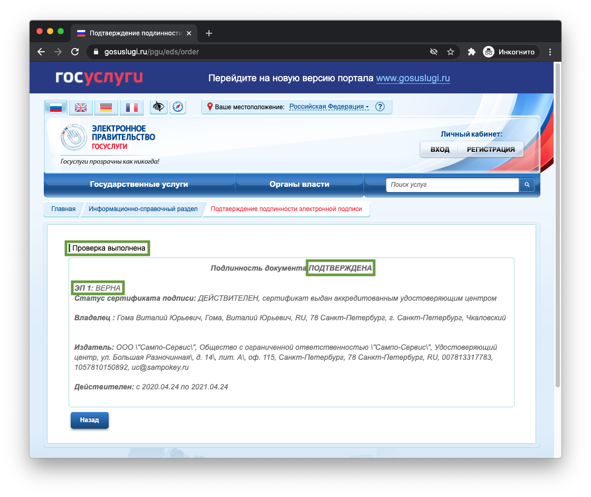
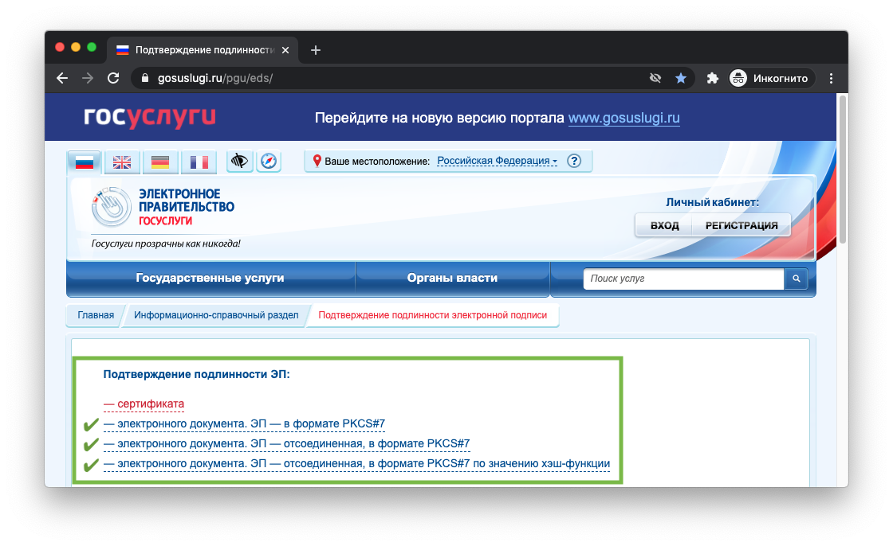
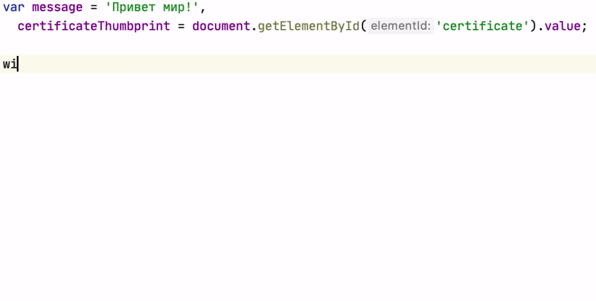
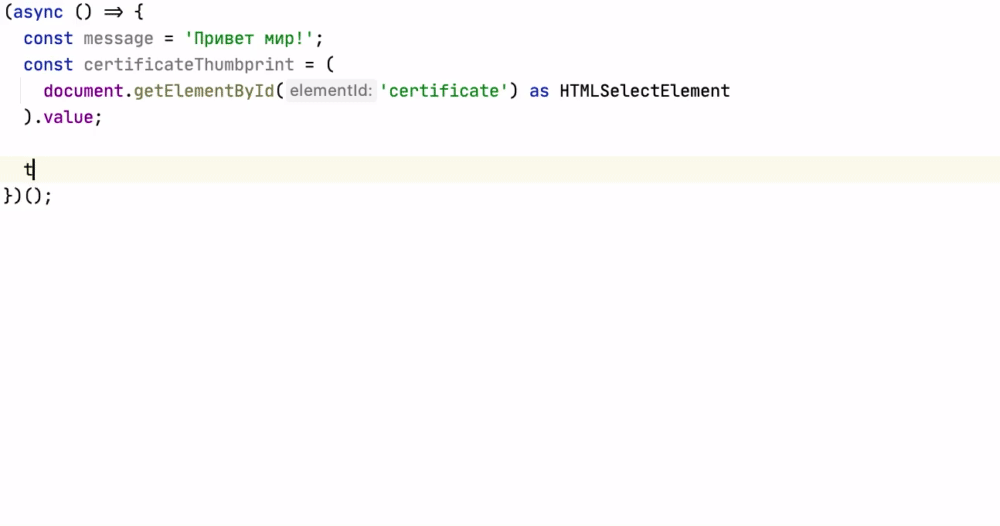

[![NPM version][npm-version-image]][npm-url]
[![NPM downloads][npm-downloads-image]][downloads-url]
[![Build Status][travis-image]][travis-url]
[![Coverage Status][coveralls-image]][coveralls-url]
[![Examples][examples-image]][examples-url]
[![Donate][donate-image]][donate-url]
<a href="https://www.jetbrains.com/?from=crypto-pro" title="При поддержке Jetbrains"></a>

<a name="cryptopro"></a>
# cryptoPro
Единое, асинхронное API для взаимодействия с КриптоПРО ЭЦП Browser Plug-In

| [](https://www.chromium.org/getting-involved/download-chromium#TOC-Downloading-old-builds-of-Chrome-Chromium)       | [](https://ftp.mozilla.org/pub/firefox/releases/)                                     | [](https://www.microsoft.com/ru-ru/download/details.aspx?id=43374)     | [](http://get.opera.com/ftp/pub/opera/desktop/)                      |
| ----------------------------------------------------------------------------------------------------------------------------------------------------------------------------------------------------------------------- | -------------------------------------------------------------------------------------------------------------------------------------------------------------------------------------------- | -------------------------------------------------------------------------------------------------------------------------------------------------------------------------------------------------------------- | --------------------------------------------------------------------------------------------------------------------------------------------------------------------- |
| __v45+__ с расширением [CryptoPro Extension for CAdES Browser Plug-in](https://chrome.google.com/webstore/detail/cryptopro-extension-for-c/iifchhfnnmpdbibifmljnfjhpififfog?utm_source=chrome-app-launcher-info-dialog) | __v43+__. Начиная с версии 52, с [расширением](https://www.cryptopro.ru/sites/default/files/products/cades/extensions/cryptopro_extension_for_cades_browser_plug_in-1.1.1-an+fx-windows.xpi) | __v9+__ с установленным [КриптоПро ЭЦП Browser plug-in](https://www.cryptopro.ru/products/cades/plugin)                                                                                                        | __v40+__ с расширением [CryptoPro Extension for CAdES Browser Plug-in](https://addons.opera.com/en/extensions/details/cryptopro-extension-for-cades-browser-plug-in/) |

[](#example-script-tag)
[](#example-script-tag)
[](#example-script-tag)

- [cryptoPro](#cryptopro)
    - [Зачем мне этот пакет?](#why)
    - [Установка](#install)
    - [API](#api)
        - [Методы объекта cryptoPro](#api-cryptopro)
        - [Методы объекта сертификата](#api-certificate)
    - [Поддерживаемые СКЗИ](#supported-cist)
    - [Примеры](#examples)
        - [Тэг script (UMD)](#example-script-tag)
        - [Angular (ES Modules + Typescript)](#example-angular)
        - [React (ES Modules + JavaScript)](#example-react)
    - [Миграция с версии 1 на 2](#upgrade-from-1-to-2)
- [Тем, кто хочет помочь](#developers)
    - [Запуск режима разработки](#dev-mode)
    - [Запуск тестов](#tests-execution)
    - [Проверка работы примеров с React и Angular](#examples-testing)
    - [Проверка пакета перед публикацией в NPM](#final-check)
- [Полезная информация](#helpful)
    - [Установка КриптоПРО CSP в Linux / OSX](#csp-install-linux-osx)
    - [Установка КриптоПРО ЭЦП browser plug-in в Linux](#plugin-install-linux)
        - [Настройка плагина для Firefox (до версии 52)](#plugin-install-old-firefox)
    - [Установка сертификатов в Linux](#certificates-install-linux)
- [Лицензия](#lisense)

<a name="why"></a>
## Зачем мне этот пакет?
КриптоПРО ЭЦП Browser Plug-In доступен в разных браузерах в двух версиях.
Асинхронной (в современных браузерах) и синхронной (в браузерах постарше).
С помощью этого пакета можно не писать реализацию под каждую версию плагина дважды.
И вместо [этого](http://cpdn.cryptopro.ru/content/cades/plugin-samples-sign.html)
и [этого](http://cpdn.cryptopro.ru/content/cades/plugin-samples-sign-cades-bes-async.html)
написать это (UMD):



или это (ES Modules + Typescript):



<a name="install"></a>
## Установка
Для NPM:
```bash
npm install crypto-pro
```

Для Yarn:
```bash
yarn add crypto-pro
```

Для Bower:
```bash
bower install crypto-pro
```

Подключение пакета как UMD модуля через тэг script:
```html
<script src="crypto-pro/dist/crypto-pro.min.js"></script>
<script>
window.cryptoPro.getUserCertificates()
  .then(function (certificates) {
    //...
  })
  .catch(function (error) {
    //...
  });
</script>
```

Подключение пакета как ES модуля с Typescript или JavaScript:
```typescript
import { getUserCertificates, Certificate } from 'crypto-pro';

(async () => {
  let certificates: Certificate[];

  try {
    certificates = await getUserCertificates();
  } catch(error) {
    // ...
  }
})();
```

Список требуемых полифиллов (если необходимы, подключаются самостоятельно):
- Promise
- Array.prototype.find

<a name="api"></a>
## API

<a name="api-cryptopro"></a>
### Методы объекта cryptoPro
- [getUserCertificates](src/api/getUserCertificates.ts) - возвращает список [сертификатов](#api-certificate), доступных пользователю в системе
- [getCertificate](src/api/getCertificate.ts) - возвращает [сертификат](#api-certificate) по отпечатку
- [createAttachedSignature](src/api/createAttachedSignature.ts) - создает совмещенную (присоединенную) подпись сообщения
- [createDetachedSignature](src/api/createDetachedSignature.ts) - создает отсоединенную (открепленную) подпись сообщения
- [createXMLSignature](src/api/createXMLSignature.ts) - создает XML подпись для документа в формате XML
- [createHash](src/api/createHash.ts) - создает хеш сообщения по ГОСТ Р 34.11-2012 256 бит
- [createSignature](src/api/createSignature.ts) - создает подпись сообщения
    > Является устаревшим и будет убран из будущих версий.
    Используйте "createAttachedSignature" и "createDetachedSignature".
- [getSystemInfo](src/api/getSystemInfo.ts) - возвращает информацию о CSP и плагине
- [isValidSystemSetup](src/api/isValidSystemSetup.ts) - возвращает флаг корректности настроек ЭП на машине

<a name="api-certificate"></a>
### Методы объекта сертификата
[Сертификат](src/api/certificate/certificate.ts) предоставляет следущее API:
- [isValid](src/api/certificate/isValid.ts) - возвращает флаг действительности сертификата
- [getCadesProp](src/api/certificate/getCadesProp.ts) - возвращает указанное внутренее свойство у сертификата в формате Cades
- [exportBase64](src/api/certificate/exportBase64.ts) - возвращает сертификат в формате base64
- [getAlgorithm](src/api/certificate/getAlgorithm.ts) - возвращает информацию об алгоритме сертификата
- [getOwnerInfo](src/api/certificate/getInfo.ts) - возвращает расшифрованную информацию о владельце сертификата
- [getIssuerInfo](src/api/certificate/getInfo.ts) - возвращает расшифрованную информацию об издателе сертификата
- [getExtendedKeyUsage](src/api/certificate/getExtendedKeyUsage.ts) - возвращает ОИД'ы сертификата
- [getDecodedExtendedKeyUsage](src/api/certificate/getDecodedExtendedKeyUsage.ts) - возвращает расшифрованные ОИД'ы
- [hasExtendedKeyUsage](src/api/certificate/hasExtendedKeyUsage.ts) - проверяет наличие ОИД'а (ОИД'ов) у сертификата

<a name="supported-cist"></a>
## Поддерживаемые СКЗИ
[КриптоПРО CSP](https://www.cryptopro.ru/products/csp/downloads) (v4.0+) *рекомендуется использование только сертифицированных версий*. Инструкция по установке:
- [Linux / OSX](#csp-install-linux-osx)
- (в Windows следуйте указаниям программы-установщика)

[КриптоПРО ЭЦП browser plug-in](https://www.cryptopro.ru/products/cades/plugin) (v2.0.12438+).

[Инструкция](#plugin-install-linux) по установке плагина в Linux. В Windows и OSX следуйте указаниям программы-установщика.

[Инструкция](#certificates-install-linux) по установке сертификатов в систему для Linux / OSX.

<a name="examples"></a>
## Примеры
Для их запуска необходим NodeJS LTS.

<a name="example-script-tag"></a>
### Тэг script (UMD)
```bash
cd examples/script-tag
npm i
npm start
```

<a name="example-angular"></a>
### Angular (ES Modules + Typescript)
```bash
cd examples/angular
npm i
```

Запуск в режиме разработки:
```bash
npm start
```

Запуск в продакшн режиме:
```bash
npm run build
npm run serve
```

<a name="example-react"></a>
### React (ES Modules + JavaScript)
```bash
cd examples/react
npm i
```

Запуск в режиме разработки:
```bash
npm start
```

Запуск в продакшн режиме:
```bash
npm run build
npm run serve
```

<a name="upgrade-from-1-to-2"></a>
## Миграция с версии 1 на 2
Внесены следующие изменения:
- Пакет собран в форматах:
    - UMD, в папке `dist/`, для подключения через тэг script. Объект `window.cryptoPro` доступен глобально.
    - ES Modules, в папке `lib/`, для использования с разными системами сборки.
    Методы API импортируются напрямую из npm пакета.
- В UMD версии переименован глобальный объект с `window.CryptoPro` на `window.cryptoPro`
- Переименованы общие методы:
    - `getCertsList` -> `getUserCertificates`
    - `getCert` -> `getCertificate`
    - `signData` -> `createSignature`
    - `isValidEDSSettings`, `isValidCSPVersion`, `isValidCadesVersion` -> `isValidSystemSetup`
- Убран метод `signDataXML`
- Переименованы методы сертификата:
    - `getProp` -> `getCadesProp`
- Результат методов сертификата `getOwnerInfo` и `getIssuerInfo`
изменился с `{ descr, title, translated }` на `{ description, title, isTranslated }`
- Принципиальная реализация методов, обращающихся к Крипто ПРО не изменилась.
Получение сертификатов, создание подписи, проверка корректности настроек работают по-прежнему.
- Убрана поддержка IE8 (Крипто ПРО его больше не поддерживает)
- Убрана поддержка КриптоПРО CSP версий ниже 4.0
- Убрана поддержка КриптоПРО ЭЦП browser plug-in версий ниже 2.0
- Доработана обработка ошибок, выбрасываемых из Крипто ПРО
- При написании кода будут работать автодополнения и подсказки
- Исправлена [проблема](https://github.com/vgoma/crypto-pro/issues/11) работы библиотеки с UglifyJs
- Методы API доступны напрямую:

В версии 1:
```javascript
window.CryptoPro.call('getSystemInfo');
```

В версии 2 (UMD):
```javascript
window.cryptoPro.getSystemInfo();
```

В версии 2 (ES Modules):
```javascript
import { getSystemInfo } from 'crypto-pro';

getSystemInfo();
```

<a name="developers"></a>
# Тем, кто хочет помочь
Буду благодарен за расширение/улучшение/доработку API.
Вам будут полезны [примеры](http://cpdn.cryptopro.ru/?url=/content/cades/plugin-samples-sign.html),
предоставляемые Крипто ПРО.

<a name="dev-mode"></a>
## Запуск режима разработки
Устанавливаем зависимости:
```bash
npm i
```

Во время работы с кодом необходим запущенный сборщик:
```bash
npm start
```

И пример, на котором можно тестировать изменения.
Удобнее всего тестировать на примере с тэгом script, тк он отвязан от фреймворков
и использует сборку в формате UMD из папки `dist/`, постоянно обновляемую пока работает
сборщик. Запускаем его таким образом:
```bash
cd examples/script-tag
npm i
npm link ../../
npm start
```
> После выполнения `npm link ../../` в директории `examples/script-tag/node_modules` папка `crypto-pro` станет ярлыком,
> указывающим на папку содержащую локально собранный пакет.

<a name="tests-execution"></a>
## Запуск тестов
Тесты написаны с использованием [Jest](https://jestjs.io/docs/en/configuration#testpathignorepatterns-arraystring):
```bash
npm test
```

<a name="examples-testing"></a>
## Проверка работы примеров с React и Angular
React и Angular используют версию сборки пакета в формате ES модулей из директории `lib/`.
Для их запуска необходимо сначала собрать пакет выполнив:
```bash
npm run build
```

После этого из папки `examples/angular` или `examples/react` залинковать пакет:
```bash
cd examples/angular
npm i
npm link ../../
```

И запустить пример в одном из двух режимов. В режиме разработки:
```bash
npm start
```

или в режиме продакшн:
```bash
npm run build
npm run serve
```

<a name="final-check"></a>
## Проверка пакета перед публикацией в NPM
Необходимо протестировать работу в заявленных браузерах, сделав это на локально запакованной версии пакета.
Для этого собираем пакет:
```bash
npm run package
mv package ..
```
> Важно переместить папку `package` куда-нибудь выше для избежания конфликтов при линковке с текущим `package.json`.

Переходим в любую директорию с примером и создаем там ссылку на только что собранный пакет:
```bash
cd examples/script-tag
npm link ../../../package
```

Проверяем работу примеров в режимах разработки и продакшн.

После завершения экспериментов можно удалить глобальную ссылку из директории `../../../package` таким образом:
```bash
cd ../../../package
npm unlink
```

<a name="helpful"></a>
# Полезная информация

<a name="csp-install-linux-osx"></a>
## Установка КриптоПРО CSP в Linux / OSX 
> Процесс установки в OSX незначительно отличается от Linux, поэтому описание приведено на примере дистрибутива семейства Debian (x64).  

Некоторые команды могут потребовать запуска с `sudo`.
Названия файлов и директорий могут отличаться из-за различий в версиях.

После загрузки [КриптоПРО CSP](https://www.cryptopro.ru/products/csp/downloads) для нужной платформы, распакуйте архив:
```bash
tar -xzvf linux-amd64_deb.tgz
chmod 777 -R linux-amd64_deb/
```

Запустите скрипт установки:
```bash
linux-amd64_deb/install.sh
```

Проверьте **отсутствие** `cprocsp-rdr-gui`:
```bash
dpkg -l | grep cprocsp-rdr
```

Установите дополнительно `cprocsp-rdr-gui-gtk`:
```bash
dpkg -i linux-amd64_deb/cprocsp-rdr-gui-gtk-64_4.0.0-4_amd64.deb
```

[Дополнительная информация по установке](https://www.cryptopro.ru/faq/gde-vzyat-dokumentatsiyu-po-ustanovke-kakie-pakety-stavit)

<a name="plugin-install-linux"></a>
## Установка КриптоПРО ЭЦП browser plugin в Linux
Загрузите [КриптоПРО ЭЦП browser plug-in](https://www.cryptopro.ru/products/cades/plugin) и распакуйте его:
```bash
mkdir cades_linux_amd64
tar -xzvf cades_linux_amd64.tar.gz -C cades_linux_amd64
```

Сконвертируйте `rpm` в `deb` пакеты при помощи утилиты `alien`:
```bash
apt-get update && apt-get install alien
cd cades_linux_amd64
alien *
```

Установите пакеты:
```bash
dpkg -i cprocsp-pki-cades_2.0.0-2_amd64.deb
dpkg -i cprocsp-pki-plugin_2.0.0-2_amd64.deb
```

Проверьте наличие файлов плагина:
```bash
ls -la /opt/cprocsp/lib/amd64 | grep libnpcades

    lrwxrwxrwx 1 root root      19 Окт 21 12:33 libnpcades.so -> libnpcades.so.2.0.0
    lrwxrwxrwx 1 root root      19 Окт 21 12:33 libnpcades.so.2 -> libnpcades.so.2.0.0
    -rwxr-xr-x 1 root root 2727236 Июн  8 14:33 libnpcades.so.2.0.0
```

<a name="plugin-install-old-firefox"></a>
### Настройка плагина для Firefox (до версии 52)
> После настройки плагина на страницах, запрашивающих работу с ЭП в панели навигации, рядом с url будет кнопка,
  позволяющая "разрешить и запомнить" использование установленного плагина.

```bash
cd /usr/lib/mozilla/plugins

cp /opt/cprocsp/lib/amd64/libnpcades.so.2.0.0 ./
ldd libnpcades.so.2.0.0

cp /opt/cprocsp/lib/amd64/libnpcades.so.2.0.0 ./libnpcades.so
ldd libnpcades.so
```
Перезапустите Firefox, и убедитесь в наличии CryptoPRO Cades plugin (см. Menu -> Addons).

<a name="certificates-install-linux"></a>
## Установка сертификатов в Linux
> В OSX процесс схож с Linux.

Подключите USB носитель с ключевыми контейнерами и проверьте результат команды:
```bash
/opt/cprocsp/bin/amd64/csptest -keyset -enum_cont -fqcn -verifyc

    CSP (Type:80) v4.0.9009 KC1 Release Ver:4.0.9797 OS:Linux CPU:AMD64 FastCode:READY:AVX.
        AcquireContext: OK. HCRYPTPROV: 16188003
        \\.\FLASH\ivanov
        \\.\FLASH\petrov
        \\.\FLASH\sidorov
        \\.\FLASH\vasiliev
        \\.\FLASH\smirnov
        OK.
        Total: SYS: 0,020 sec USR: 0,060 sec UTC: 0,180 sec
```

Скопируйте ключевой контейнер `\\.\FLASH\.\sidorov` на жесткий диск:
```bash
/opt/cprocsp/bin/amd64/csptest -keycopy -contsrc '\\.\FLASH\sidorov' -contdest '\\.\HDIMAGE\sidor'

    CSP (Type:80) v4.0.9009 KC1 Release Ver:4.0.9797 OS:Linux CPU:AMD64 FastCode:READY:AVX.
    CryptAcquireContext succeeded.HCRYPTPROV: 38556259
    CryptAcquireContext succeeded.HCRYPTPROV: 38770755
    Total: SYS: 0,000 sec USR: 0,100 sec UTC: 14,920 sec
    [ErrorCode: 0x00000000]
```
> Наличие [ErrorCode: 0x00000000] в завершении каждой команды КриптоПРО говорит о ее успешном выполнении.

Проверьте наличие нового контейнера `\\.\HDIMAGE\sidor`:
```bash
/opt/cprocsp/bin/amd64/csptest -keyset -enum_cont -fqcn -verifyc

    CSP (Type:80) v4.0.9009 KC1 Release Ver:4.0.9797 OS:Linux CPU:AMD64 FastCode:READY:AVX.
    AcquireContext: OK. HCRYPTPROV: 34554467
    \\.\FLASH\ivanov
    \\.\FLASH\petrov
    \\.\FLASH\sidorov
    \\.\FLASH\vasiliev
    \\.\FLASH\smirnov
    \\.\HDIMAGE\sidor
    OK.
    Total: SYS: 0,010 sec USR: 0,050 sec UTC: 0,130 sec
    [ErrorCode: 0x00000000]
```

Установите личный сертификат:
```bash
/opt/cprocsp/bin/amd64/certmgr -inst -cont '\\.\HDIMAGE\sidor'
```
> Возможно в выводе вы ссылку на сертификат УЦ

При необходимости загрузите сертификат удостоверяющего центра и установите его командой:
```bash
/opt/cprocsp/bin/amd64/certmgr -inst -store uroot -file <файл сертификата>.crt
```

После чего, при проверке установленного личного сертификата вы увидите `PrivateKey Link: Yes`:
```bash
/opt/cprocsp/bin/amd64/certmgr -list -store uMy
```

<a name="lisense"></a>
# Лицензия
MIT

[npm-url]: https://npmjs.org/package/crypto-pro
[npm-version-image]: http://img.shields.io/npm/v/crypto-pro.svg?style=flat
[npm-downloads-image]: http://img.shields.io/npm/dm/crypto-pro.svg?style=flat
[downloads-url]: https://npmcharts.com/compare/crypto-pro?minimal=true
[travis-url]: https://travis-ci.org/vgoma/crypto-pro
[travis-image]: http://img.shields.io/travis/vgoma/crypto-pro/master.svg?style=flat
[coveralls-image]: https://coveralls.io/repos/github/vgoma/crypto-pro/badge.svg?branch=master
[coveralls-url]: https://coveralls.io/github/vgoma/crypto-pro?branch=master
[donate-image]: https://img.shields.io/badge/%D1%81%D0%BF%D0%B0%D1%81%D0%B8%D0%B1%D0%BE-%E2%82%BD-yellow
[donate-url]: https://money.yandex.ru/to/410011609769902
[examples-image]: https://img.shields.io/badge/examples-folder-pink
[examples-url]: examples
